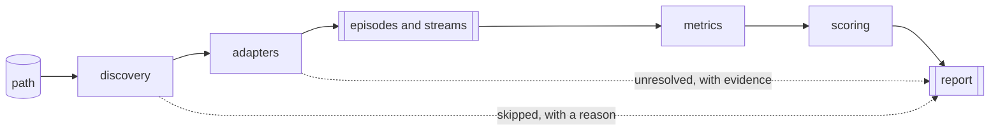

# Architecture

Kalanos grades multimodal recordings for how useful they are as training data. It is a library with a command-line front end, and both are supported surfaces.



The grading policy is a YAML file rather than code, and works today. Which formats can be read, which metrics run, and how results are rendered are designed as plugins too. The adapter protocol, its entry-point discovery and selection by confidence fill the format slot, and a discovered adapter is one a run will use. The metric and reporter registries declare their own entry-point groups and `kalanos plugins` lists all three, but that discovery feeds the listings alone: grading and report writing still see only what ships in this package.

## Domain model

```
Dataset                     the analysed path
└── Episode                 one recording; may draw on several files
    └── Stream              one taxonomy-typed timestamped signal
        └── Channel         one scalar series
```

An **Episode** is one recording: a robot moving an arm from A to B while holding something. A **Stream** is one signal captured during it, such as the arm's joint positions, or the video from a camera on the wrist. A **Channel** is one scalar series inside a stream, such as the third joint.

A Stream carries:

| Field | Meaning |
|---|---|
| `taxonomy_type` | what this signal is, as a key in `dictionary.yaml` |
| `instance` | which one, when a recording has several |
| `kind` | the payload's shape: series, image, video, points, events, text, audio |
| `timestamps` | canonical seconds, eager |
| `payload` | the data, lazy |
| `source_path`, `source_field` | which file it came from and what it was called there |
| `clock` | capture, receive, log, or unknown |
| `is_regular` | whether the sampling behind this stream classified as regular |

Timestamps are eager because every timing metric needs them and they are cheap. Payloads are lazy because decoding a camera stream is not, and most of a grade can be computed without doing it.

`clock` exists so a synthesised timebase can be told apart from a recorded one. Some formats record no wall-clock time per sample and only declare a nominal rate. A latency measured against timestamps derived from that rate would be a restatement of the rate, so a metric that depends on real timing reports lower confidence rather than a number that looks measured.

### Why there is no file level

One file can hold many episodes: a shard packs hundreds, and a chunked parquet selects them by an index column. One episode can span many files: a table of joint states beside one video per camera. File-to-episode is many-to-many in both directions, so a file cannot be a level in the tree without duplicating something.

A stream, however, comes from exactly one file. Provenance therefore lives on the stream, and an episode's source files derive from its streams.

Files that were never read still have to be reported. `Report.skipped` and `Report.unresolved` carry them, with the reason and the evidence, which is a flat list beside the graded tree rather than a level inside it.

### Instance rather than a device level

A factory CSV holding forty machines under an id column, and a bimanual robot with two arms, are the same problem. Both put several subjects in one recording, and averaging over them would hide a single broken subject inside a good aggregate.

`instance` solves it without a level. Two arms produce two streams of `proprio.joint_position`, distinguished by their instance, and each is graded separately. A recording with one subject produces one stream through the same code path.

Metrics attach at Channel and Stream, and roll up Stream → Episode → Dataset.

## Adapters

The protocol, discovery, selection by confidence, and eight built-in adapters exist: `csv`, `delimited`, `json` and `jsonl` for text tables; `lerobot_v2` and `lerobot_v3` for LeRobot dataset directories; and `hdf5` and `mcap`, each behind its own extra.

An adapter reads one family of formats.

```python
class Adapter(Protocol):
    name: str

    def detect(self, path: UPath) -> float:
        """How confident this adapter is that it can read the path, from 0 to 1."""

    def describe(self, path: UPath) -> DatasetInfo:
        """Facts available before reading: episode count, declared rate, robot type."""

    def episodes(self, path: UPath, sample: int | None = None) -> Iterator[Episode]:
        """Yield episodes, lazily, stopping early when sample is given."""
```

Adapters register through Python entry points under `kalanos.adapters`, which is how a third-party package adds a format without any change here. The built-in adapters use the same mechanism with no privileged path, so the plugin API is exercised by the code we maintain and cannot quietly stop working.

For development, where publishing a package first would be absurd, a single file can be loaded with `--plugin` or dropped in the user plugin directory. That executes Python from a path the user named, which is the same trust boundary as installing a package.

**Selection is by confidence.** Every adapter bids on a path and the highest bid wins. A tie is an error naming the tied adapters and the path it happened on, because reading a dataset with the wrong reader produces a report that is wrong in a way nothing downstream can detect. A format that announces itself bids high; generic text adapters bid low, so a specialised adapter outranks them.

A tie has no override. One folder can need a different adapter per file, so a single choice cannot express the answer, and offering one would point the user at a fix that does not fit the case they are in. Two adapters bidding equally on the same file is a bug in one of their `detect` methods; the error says which two, so it can be fixed where it is.

A path no adapter claims is skipped with a reason. In a folder of two hundred files where twelve are gradeable, that is the normal case.

The tabular adapters read one file as one episode. The LeRobot adapters exercise the many-to-many relation the domain model is built for: one parquet chunk holds many episodes, split by `episode_index`, and one episode spans that parquet plus an mp4 per camera.

## Schema inference

Two different jobs get called inference, and they belong in different places.

Working out *which adapter can read a file* is format detection, and it belongs to the adapters, because each knows its own signature.

Working out *which column is the time axis, in what unit, whether the sampling is regular, which column separates subjects, and what each field means* is schema inference. It operates on a frame that has already been parsed, so it is format-agnostic, and it is as useful to a parquet reader that got unfamiliar field names as to a CSV reader.

So it is a library that any adapter calls:

```python
inference.time_axis(frame, entity_column=...)  # column, unit, confidence, evidence
inference.entity_key(frame)  # which column separates subjects, or none
inference.regularity(gaps)  # regular with an interval, or irregular
inference.roles(columns, dictionary)  # names to taxonomy types, ambiguities reported
```

Everything returns evidence and a confidence. A wrong timestamp column corrupts every metric downstream while looking entirely fine, so a file that cannot be resolved becomes an `UnresolvedSource` carrying what *was* determined, instead of a guess nobody can check.

`TabularAdapter` puts the sequence together once, so a table-shaped format adapter writes only its parse step:

```python
class TabularAdapter(Adapter):
    def parse(self, path: UPath) -> pl.DataFrame:
        """Bytes to a frame. The only format-specific part."""

    def episodes(self, path, sample=None):
        frame = self.parse(path)
        ...  # infer, split by instance, group columns into streams
```

`TabularAdapter` runs this sequence for the four text-table adapters — `csv`, `delimited`, `json` and `jsonl` all subclass it and write only their parse step.

CSV, line-delimited JSON, whitespace-delimited text and nested JSON differ only in how bytes become a frame.

Formats that declare their own schema skip the parts they know and still call `roles()`. A field named `observation.state` has to be looked up in the dictionary before anything knows it means joint position.

**A column that resolves to no taxonomy type becomes a stream typed `unmapped.<name>`.** Without that, an unrecognised field would vanish and the user would lose a sensor without noticing.

## Escalation

Use the cheapest thing that can decide the question: heuristic before statistical model, statistical model before language model.

In inference, most of the work is deterministic. Delimiters, containers, comment headers, monotonic time columns and magnitude-based unit inference are all things a parser can decide. A model costs seconds or minutes per file on CPU, which is the entire runtime budget for a folder of hundreds, and it fails differently: a heuristic says which signal was missing, while a model produces a plausible wrong answer. Some schemas are exotic enough that no rule will reach them, with undocumented nesting or field names no alias table anticipates. Those are what a model backend is for. The accumulating `UnresolvedSource` records are both the trigger for adding one and the corpus to measure it against.

The same ordering applies to video. Decoding every frame of every episode to grade a dataset is not a plausible thing to do, so frame metrics run on a stratified sample and report how many frames they looked at. Frozen-frame detection needs no full decode at all, since hashing a strided subsample finds duplicates cheaply, and a camera that stopped updating looks fine in every other metric.

And in metrics generally. Descriptive statistics answer most questions about a signal, in a form a threshold can grade. Faults no fixed threshold catches, such as drift, regime change, or a pattern anomalous only relative to the rest of the recording, want a time-series detector instead. Either way the output is a `MetricResult` and the requirements gate applies unchanged, so scoring never learns which kind of thing produced a number.

## Metrics

A metric declares what it needs and the registry filters.

```python
@metric(
    level=Level.STREAM,
    family=Family.MOTION,
    requires=Requires(
        regular_sampling=True,
        min_samples=64,
        taxonomy=["proprio.joint_position"],
    ),
)
def mean_jerk_norm(ctx: StreamContext) -> MetricResult: ...
```

`family` is a required argument to the decorator and must be one of the nine, checked at import. `Requires` gates on taxonomy as well as on sampling regularity and sample count: at CHANNEL and STREAM any-of, at EPISODE all-of.

Requirements are checked before the function is called. **An unmet requirement produces `not_applicable` with a reason.** Never a raise, never a zero. "This signal is bad" and "this metric could not run here" are different facts and stay different all the way to the report.

Families name the question a metric asks, and the taxonomy already names the signal it reads. `timing`, `integrity`, `motion`, `consistency`, `vision`, `coverage`, `calibration`, `annotation`, `schema`. They are the weight keys in `policy.yaml`.

Some metrics compare streams: a commanded trajectory against the measured one, a camera's clock against a proprioceptive one. Those are episode-level, gate on taxonomy alone, and receive an `EpisodeContext` over the whole recording.

**Adding a metric is one decorated function, one policy entry, one contract test.** If it ever requires touching the registry, the rollup and three call sites, the abstraction has broken; fix that before adding the metric.

## Scoring and findings

Scoring returns two things from one call: the score tree, and a flat list of findings.

```python
score_metrics(results, level=..., taxonomy_type=..., policy=..., location=...) -> (graded, ScoreResult, [Finding, ...])
```

A `Finding` carries what was measured, how severe it is, where it happened, and enough evidence to check the claim without rerunning anything. `reporting` flattens every channel's findings up to `Report.findings`, sorted worst first, so a CI gate can read `report.findings[0]`. Deriving the same list by walking the four-level tree at render time would mean every consumer derived it differently, so the terminal card reads `Report.findings` directly.

**Severity is assigned by the policy, in scoring.** A metric returns a measurement. If a metric could set its own severity, thresholds would live in metric code and the policy file would only be advisory.

`not_applicable` results produce no finding, because a measurement that could not be taken is not a defect.

## Configuration

Two files, split between facts and policy.

| File | Answers | Changes |
|---|---|---|
| `dictionary.yaml` | *What is this signal?* Taxonomy types, aliases, unit, expected shape, plausible range. | Rarely. Ships in the wheel. Required. |
| `policy.yaml` | *How do I grade this deployment?* Thresholds, weights, severities, declared limits. | Per deployment. A default ships; users override it. |

The split exists because thresholds vary by signal and by installation while physics does not. Joint velocity wants a different noise floor than joint acceleration, and a servo vendor and a factory team want different tolerances for the same signal. Combining them would mean overriding one number requires forking the whole dictionary.

Both load into Pydantic models, and neither is read except through its loader.

### How a measurement becomes points

Each metric interpolates linearly between a good value and a bad one.

```yaml
metrics:
  timing.drop_rate:
    weight: 1.0
    thresholds:
      default: {good: 0.01, bad: 0.05}
  integrity.snr_db:
    higher_is_better: true
    thresholds:
      proprio.joint_velocity: {good: 20, bad: 12}
      proprio.joint_acceleration: {good: 12, bad: 6}
  timing.effective_hz:
    mode: abs_dev
    target: nominal_hz
    limits:
      nominal_hz: 100.0
    thresholds:
      default: {good: 0.02, bad: 0.25}

# One weight per family; the six not shown here follow the same shape.
family_weights:
  timing: 0.25
  integrity: 0.25
  motion: 0.20

missing_family: skip
fail_penalty: 15
fail_penalty_cap: 40

letters:
  A: 90
  B: 80
  C: 70
  D: 60
```

The shipped default policy carries only the values `docs/METRICS.md` records as settled, so `family_weights` and the fail penalty are absent from it.

Bands are keyed by taxonomy type, since the same metric can want a different band per signal — `snr_db` above — with `"default"` applying to any type without its own entry. A value at or better than `good` scores 100, at or worse than `bad` scores 0, and interpolates between. A metric slightly past its threshold is therefore not punished as hard as one an order of magnitude past it. `higher_is_better` flips the direction, and `mode: abs_dev` measures deviation from a named target, which is how a rate is graded against a declared nominal rather than against an absolute number.

**Weights are relative and do not sum to one.** `missing_family: skip` renormalises them over the families that produced a graded metric. A recording with no cameras produces no vision metrics, and penalising it for that would make the grade a statement about the equipment rather than about the data.

`report_only` and `not_applicable` results are excluded from the denominator. A metric that could not run must not silently cost points.

## Reporting

The report renders to the terminal, JSON, YAML and HTML from one model. The terminal card leads with the score, then names what is wrong through its own findings block.

Two display rules hold in every format:

- A `not_applicable` result renders differently from a `critical` one, and never as a zero.
- A skipped source is shown with its reason. A user who points at two hundred files and sees twelve analysed has to be able to find out what happened to the other hundred and eighty-eight.

## Decisions

**Ships as a pip-installable package.** `pip install kalanos`, then `kalanos <command>`. Optional features are extras rather than build variants, so there is one artifact and one code path. An extra is added once the code behind it exists: installing a dependency for code that is not there misleads whoever installed it.

**Library and CLI are both supported surfaces.** The intent is a small public API at the package root, pinned by a test. Everything else stays internal and stays free to move.

**The CLI is a group of commands.** Adding a command or a flag must never change how an existing invocation behaves.

**A path in, a report out.** `grade` takes a file or a folder and treats both the same way. Kalanos never writes to the data it reads: `reporting` is the only stage that opens a file for writing, and a test enforces it.

**Remote roots stream; nothing downloads up front.** A Hugging Face dataset (`hf://datasets/<repo>[@rev]`, or its `https://huggingface.co/datasets/…` page) is pinned to one commit before grading and read through fsspec, so only the bytes an adapter opens are fetched: parquet and JSON in full, video only if a frame metric runs. Nothing outlives the run. A remote root whose listed size or file count is over `KALANOS_REMOTE_MAX_BYTES` / `KALANOS_REMOTE_MAX_FILES` is refused before any file is read. Credentials are whatever `huggingface_hub` reads (`HF_TOKEN`). Other git hosts, and a bounded cache for formats that cannot seek, are not built.

**No database.** Analysis is a pure function of the path, the dictionary and the policy. Results serialise to files, which gives history and re-download without a schema or migrations. The `Report` model therefore carries a `schema_version` from the first release, because old files will be read by newer code. Revisit when a query spans runs; trend over time is the likely trigger.

**Grading is a logging and hardware quality gate.** Nothing signal-derived claims the task succeeded. A torque spike is either a collision or a firm grasp, and the signal alone does not distinguish them. Judging the task would need an input beyond the signals, such as labels or video review.

**Apache-2.0, with no contributor agreement.** Contributions come in under the licence the project goes out under. The consequence to know before it matters: the project cannot be moved to different licence terms later without the agreement of everyone who has contributed.

## What is not built yet

- `--plugin` as a CLI flag for loading a single-file adapter without publishing a package.
- Every metric family beyond `timing`, `integrity` and `motion`: `consistency`, `vision`, `coverage`, `calibration`, `annotation` and `schema`.
- Running an out-of-tree metric, or writing a report through an out-of-tree reporter. Both groups are discovered and listed; neither is wired into a run.
- Frame decoding: video streams are carried as lazy payloads, but no vision metric decodes one yet, so a frame is never graded.
- The CLI beyond `grade`, the plugin listings and `new` — namely `inspect`, `--fail-under` and `--sample`.

The issue tracker holds the sequence. This document describes the design those issues implement.
